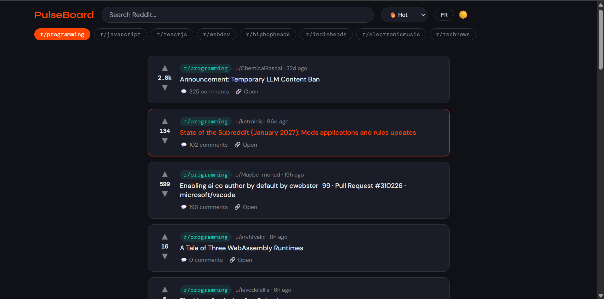
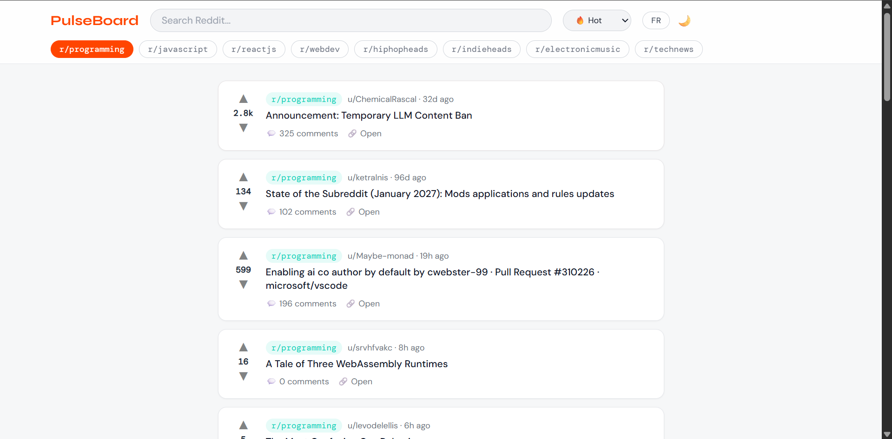
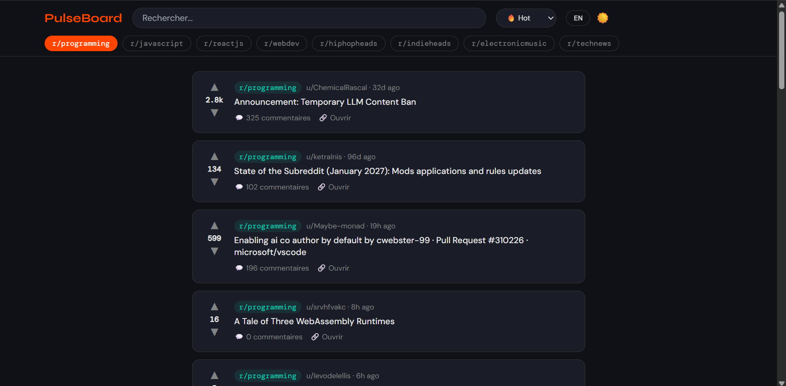
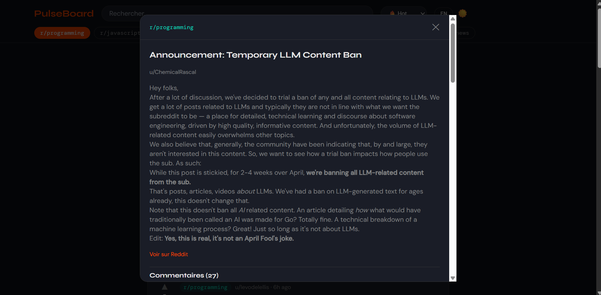

# PulseBoard — Tech & Music Reddit Reader


> A beautifully designed Reddit reader curated for tech and music communities. Built with React, Redux Toolkit, and the Reddit JSON API.

**[Live Demo →](https://pulseboard-zeta-inky.vercel.app)**

---

## Screenshots

### Dark Mode


### Light Mode


### French Translation


### Discussion Card



---

## Features

- **Real-time Reddit data** — Fetches live posts from 8 curated tech and music subreddits using Reddit's public JSON API
- **Smart sorting** — Filter posts by Hot, New, Top, or Rising
- **Debounced search** — Search across Reddit with a clear button to reset results instantly
- **Post detail modal** — Click any post to view full content, images, and comments in a slide-up modal
- **Markdown rendering** — Reddit post bodies and comments render with proper Markdown formatting
- **Dark / Light mode** — Full theme toggle with smooth transitions across all components
- **Bilingual UI (FR/EN)** — Complete French and English interface toggle, reflecting real-world bilingual product design
- **Framer Motion animations** — Posts stagger in on load; modal fades in and out
- **Skeleton loaders** — Placeholder cards display while data is fetching
- **Error state with retry** — Graceful error handling with a retry button for failed API calls
- **Fully responsive** — Mobile-first design that adapts cleanly to tablet and desktop layouts

---

## Subreddits Covered

| Category | Subreddits |
|----------|-----------|
| Tech | r/programming, r/javascript, r/reactjs, r/webdev, r/technews |
| Music | r/hiphopheads, r/indieheads, r/electronicmusic |

---

## Tech Stack

| Layer | Technology |
|-------|-----------|
| Framework | React 18 + TypeScript |
| State Management | Redux Toolkit (createAsyncThunk) |
| Styling | Tailwind CSS v3 |
| Animations | Framer Motion |
| Routing | React Router v6 |
| Markdown | react-markdown |
| Build Tool | Vite |
| Deployment | Vercel |
| API | Reddit JSON API (no authentication required) |

---

## Design Process

The UI was designed from scratch using **Figma** before any code was written.

The design process followed these steps:

1. **Color system** — Defined a full token set covering dark mode, light mode, brand accent (`#ff4500`), and teal highlight (`#0dd3bb`) as Figma local styles
2. **Typography** — Selected Syne (headings), DM Sans (body), and DM Mono (metadata/tags) from Google Fonts for an editorial, modern feel
3. **Component design** — Built 7 reusable Figma components (Navbar, SubredditChip, VoteBar, PostCard, SkeletonCard, ErrorState, PostDetail) before assembling screens
4. **Screen wireframes** — Designed 5 screens: Home feed (mobile + desktop), Search results, Post detail modal, and Error state
5. **Prototype** — Connected screens with interactions in Figma prototype mode to validate the user flow before building

This design-first approach ensured the final product matched the intended visual direction and eliminated rework during development.

---

## Architecture

```
src/
├── components/
│   ├── Navbar.tsx          # Search, subreddit chips, sort, FR/EN, dark mode
│   ├── PostCard.tsx        # Individual post with vote bar, metadata, image
│   ├── PostDetail.tsx      # Full post modal with comments
│   ├── SkeletonCard.tsx    # Loading placeholder
│   └── ErrorState.tsx      # Error UI with retry
├── features/
│   └── posts/
│       └── postsSlice.ts   # Redux slice — fetchPosts, searchPosts, fetchComments
├── store.ts                # Redux store configuration
├── App.tsx                 # Root component — layout, theme, state
└── main.tsx                # Entry point with Redux Provider
```

---

## State Management

All async data fetching is handled through Redux Toolkit's `createAsyncThunk`, with three thunks:

- `fetchPosts(subreddit)` — loads posts for the active subreddit with the current sort order
- `searchPosts(query)` — searches Reddit globally for a term
- `fetchComments({ subreddit, postId })` — loads comments for a selected post

Each thunk manages `loading`, `succeeded`, and `failed` states independently, allowing the UI to show skeleton loaders, error messages, and retry options appropriately.

---

## Reddit API

This app uses Reddit's **undocumented public JSON API** — no OAuth or API key required.

```
GET https://www.reddit.com/r/{subreddit}/{sort}.json?limit=25
GET https://www.reddit.com/search.json?q={query}&limit=25
GET https://www.reddit.com/r/{subreddit}/comments/{postId}.json
```

> **Note:** Reddit's free API tier is limited to 10 requests per minute. The app handles rate limit failures gracefully with an error state and retry button.

---

## Running Locally

```bash
# Clone the repository
git clone https://github.com/your-username/pulseboard.git
cd pulseboard

# Install dependencies
npm install

# Start the development server
npm run dev
```

Open [http://localhost:5173](http://localhost:5173) in your browser.

**Requirements:** Node.js 18+ and npm 9+

---

## Deployment

This app is deployed on **Vercel** with zero configuration. Every push to the `main` branch triggers an automatic redeployment.

To deploy your own instance:

```bash
npm install -g vercel
vercel
```

---

## What I'd Add Next

- **Infinite scroll** — Load more posts automatically as the user scrolls down
- **Saved posts** — Persist bookmarked posts to localStorage
- **Comment threading** — Render nested comment replies at multiple depth levels
- **PWA support** — Make the app installable on mobile as a Progressive Web App
- **CI/CD pipeline** — GitHub Actions workflow to run lint and tests on every PR

---

## Author

**Shekina Uchegbulem**
[Portfolio](https://shekinauchegbulem.com) · [GitHub](https://github.com/Sheks17) · [LinkedIn](https://linkedin.com/in/shekina-uchegbulem-72a685136)

---

## License

MIT